# AdjacencyList

The `AdjacencyList` in Parcel is a complex implementation of
an otherwise [straightforward data structure](https://en.wikipedia.org/wiki/Adjacency_list).
The core ideas behind the `AdjacencyList` are:

- Any two **nodes** that are connected by an **edge** are said to be _adjacent_
- For _any_ node in the graph, every _adjacent node_ should be discoverable
  in _linear time_.

Conceptually, this is achieved by associating each edge that is added
_to or from_ a node with a previous edge that was added to or from that node.

Where Parcel's `AdjencyList` gets complex is in its _data layer_, which is
designed for:

- shared access in a multithreaded runtime
- fast serialization and deserialization

## A list of lists

The simplest way of thinking about `AdjacencyList` is as a _list of lists_.
The primary list contains (conceptually) _node_ structs (ordered by numeric id),
with each field on the struct pointing to _doubly linked lists_ of (again, conceptual)
_edge_ structs that also connect to or from the same node (ordered by insertion).

This looks something like:

```flow
// NOTE: Not a real type, just an illustration!
type AdjacencyList<{
  id: NodeId,
  incoming?: EdgeList,
  incomingReverse?: EdgeList,
  outgoing?: EdgeList,
  outgoingReverse?: EdgeList,
}>

type EdgeList<{
  from: NodeId,
  to: NodeId,
}>
```

<table style="white-space: nowrap">
<tr><th>So, given a graph like:</th><th>you can imagine doubly linked lists like:</th></tr>
<tr><td>

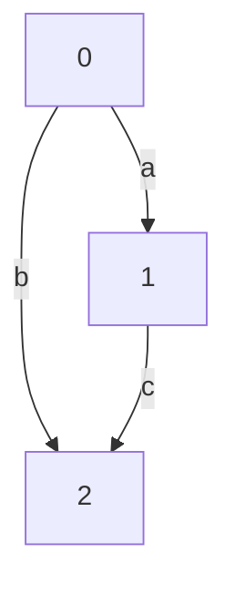

</td>
<td style="width: 100%">

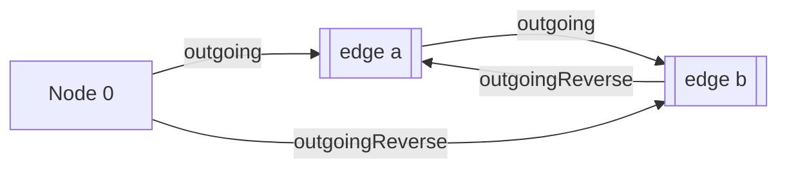

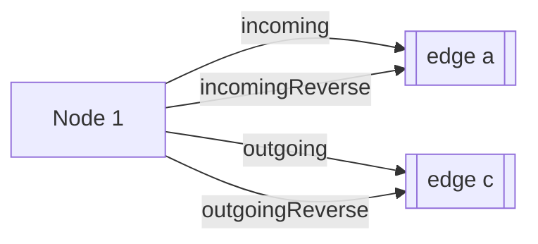

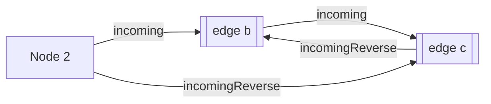

</td></tr>
</table>

This makes traversal of every edge of the graph _from any node_
a straightforward process of following the links.

## `SharedTypeMap`

Under the hood, things are less straightforward.

Since Parcel is multi-threaded, its implementation of `AdjacencyList`
features another core idea:

- The data stored in the `AdjacencyList` should be accessible
  from multiple threads with _no overhead_

Here, _overhead_ refers to the serialization costs that add up
in multi-threading scenarios.

To accommodate this, `AdjacencyList` features a custom data structure called
the `SharedTypeMap`:

- **Shared** because it is a [`Uint32Array`](https://developer.mozilla.org/en-US/docs/Web/JavaScript/Reference/Global_Objects/Uint32Array)
  backed by a [`SharedArrayBuffer`](https://developer.mozilla.org/en-US/docs/Web/JavaScript/Reference/Global_Objects/SharedArrayBuffer)
- **Type** because each item has a `TYPE` field
- **Map** because it is an implementation of a [hash map](https://en.wikipedia.org/wiki/Hash_table),
  using a [coalesced hashing](https://en.wikipedia.org/wiki/Coalesced_hashing) strategy

This means that data being added to `SharedTypeMap` gets a pass through
a hash function to produce stable key for storing and retrieving that data.

### Why _Type_, though?

Two nodes in a Parcel graph may be related to in each other in more than one way.
In order to represent multiple relationships between the same two nodes,
each _edge_ that connects the nodes has a _type_.

Thus, when storing data about connections between adjacent nodes,
`AdjacencyList` uses the _type_ as part of the identifying information.

### `Uint32Array` partitions

As mentioned above, to deal with collisions, `SharedTypeMap` employs a version
of a coalesced hashing strategy. In this version:

- A contiguous array of memory is maintained for storing the data
- A portion of the array is designated as the hash table
- The rest of the array is the addressable space, which is where values are stored
- the hash table stores pointers into the addressable space

The `SharedTypeMap` is partitioned into 3 subarrays:

```mermaid
graph LR
  header ~~~ hashtable ~~~ items

  subgraph header
    direction LR
    0[0: CAPACITY] ~~~ 1[1: COUNT]
  end

  subgraph hashtable[hash table]
    direction LR
    2[2: hash 0] ~~~ 3[3: hash 1] ~~~ 4[4: hash 2]
  end

  subgraph items[addressable space]
    direction LR
    item1 ~~~ item2 ~~~ item3 ~~~ item4

    subgraph item1[item 1]
      direction LR
      5([5: NEXT]) ~~~ 6[6: TYPE]
    end

    subgraph item2[item 2]
      direction LR
      7([7: NEXT]) ~~~ 8[8: TYPE]
    end

    subgraph item3[item 3]
      direction LR
      9([9: NEXT]) ~~~ 10[10: TYPE]
    end

    subgraph item4[item 4]
      direction LR
      11([11: NEXT]) ~~~ 12[12: TYPE]
    end
  end
```

- The _header_ partition stores metadata:
  - `CAPACITY`: the total number of items that can fit in the array
    this is always equal to the length of the _hashtable_ partition.
  - `COUNT`: the number of items that are currently in
    the _addressable space_ partition.
- The _hash table_ partition stores _addresses_, which are pointers
  into the _addressable space_ partition
  - each index represents the head of a linked list known as a _bucket_
- The _addressable space_ partition stores contiguous slices of _item data_:
  - `NEXT`: the _address_ of the next item with the same hash as this item;
    this is a _link_ in the hash _bucket_.
  - `TYPE`: the item's type

Note that the fields described above are _inherited_ by `NodeTypeMap`
and `EdgeTypeMap`. They both extend this base set with fields of their own.

When there is a hash collision, the previous value is augmented with a link
to the address of the colliding value.

These linked lists of values that have hash collisions are known as _buckets_.

### Hash buckets: another list of lists

Though `SharedTypeMap` stores data in a _hash table_, it presents
an API that is more like a _linked list_. Instead of adding an item
to the `SharedTypeMap` through something like an `add` method,
`SharedTypeMap` has a method called `link`:

```flow
  link(hash: THash, item: TAddress, type: TItemType): void;
```

This method pairs with `getNextAddress`:

```flow
  getNextAddress(): TAddress
```

This is because `SharedTypeMap` is really a _base class_ implementation;
its subclasses (See [NodeTypeMap](#nodetypemap) and [EdgeTypeMap](#edgetypemap))
extend this API with more map-like `add` methods.

As `link` implies, each index in the hash table can be thought of
as the head of a _linked list_.

When an item is added to a `SharedTypeMap` (or rather, to one of its subclasses),
the `getNextAddress` method is invoked to find the next location in the
_addressable space_ that is unoccupied. The next address is always computed
in constant time by adding the current item count (multiplied by the item size)
to the offset of the first addressable space. This has the effect of storing items
in the addressable space _in insertion order_.

For example, here we see that hash `0` has 1 collision:

<table style="white-space: nowrap">
<tr><th>given an insertion order:</th><th>imagine a list like:</th><tr>
<tr><td>

```
// map.link(hash, address, type)
map.link(0, map.getNextAddress(), 1)
map.link(1, map.getNextAddress(), 2)
map.link(2, map.getNextAddress(), 3)
map.link(0, map.getNextAddress(), 1)
```

</td>
<td width="100%">

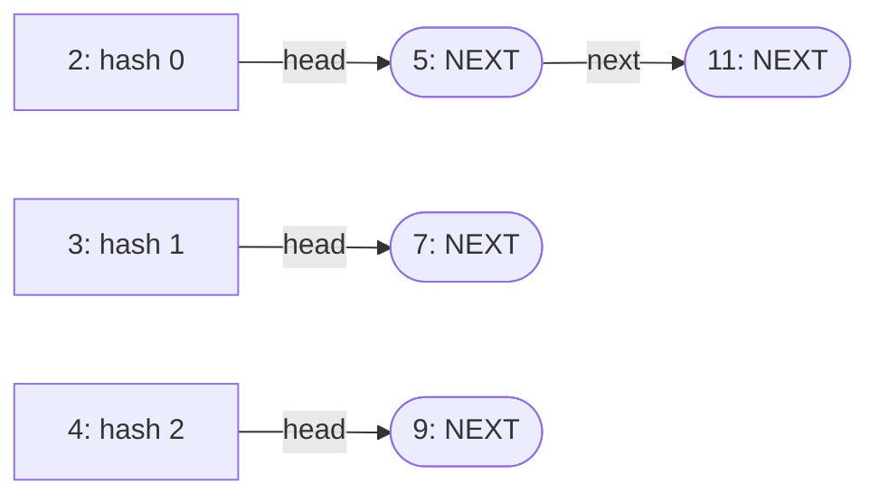

</td></tr>
</table>

Or, as raw `Uint32Array` data:

| label | CAPACITY | COUNT | #   | #   | #   | NEXT | TYPE | NEXT | TYPE | NEXT | TYPE | NEXT | TYPE |
| ----- | -------- | ----- | --- | --- | --- | ---- | ---- | ---- | ---- | ---- | ---- | ---- | ---- |
| index | 0        | 1     | 2   | 3   | 4   | 5    | 6    | 7    | 8    | 9    | 10   | 11   | 12   |
| value | 4        | 4     | 5   | 7   | 9   | 11   | 1    | 0    | 2    | 0    | 3    | 0    | 1    |

Notice that, thanks to `getNextAddress()`, the items are stored
in _insertion order_, not by type or hash!

Also notice that the hashes we used to `link` are mapped to indices in the hash table
(the `#` above), and that the values stored at those indices are the _addresses_
returned by `getNextAddress`.

You may have also noticed that our last `link` has a _collision_ with our first `link`
(they both use hash `0`). In that case, the `address` for our last `link` is stored
in the `NEXT` field of the item at the `address` that is currently stored for hash `0`:

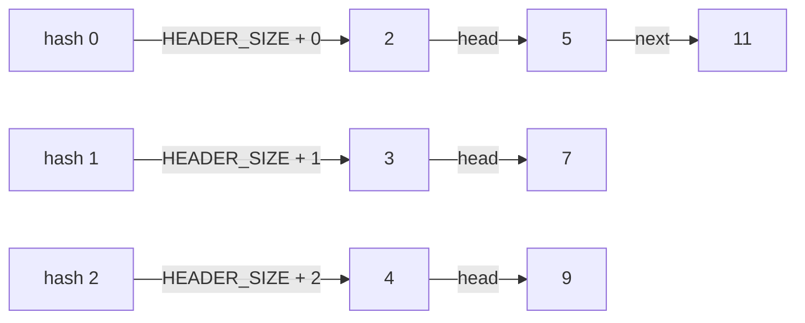

## How `AdjacencyList` uses `SharedTypeMap`

As mentioned above, `SharedTypeMap` is a _base implementation_; it isn't used
directly. `AdjacencyList` uses two subclasses of `SharedTypeMap`:

- `NodeTypeMap`, which is referred to internally as `nodes`
- `EdgeTypeMap`, which is referred to internally as `edges`

The business of `AdjacencyList` is therefore interacting with these two maps when:

- **adding** edges by _linking_ records in `nodes` with records in `edges`
- **deleting** edges by _unlinking_ records in `nodes` from records in `edges`
- **resizing** either map when they run low on space
- **traversing** edges by following the links from records in `nodes`
  to records in `edges` (and back)

## `EdgeTypeMap`

The `EdgeTypeMap` extends `SharedTypeMap` with API for:

- **adding** edges
- **deleting** edges
- **linking** adjacent edges
- **unlinking** adjacent edges

### Edge hashes

Edges are identified by a hash of their `to`, `from`, and `type` values.

For any given set of these values, the hash function deterministically produces
a number that that fits within the **current capacity** of the `EdgeTypeMap`.

That hash number is then the index in the hash table where the _head_
of the linked list of edges with this hash is stored.

See [Hash buckets: another list of lists](#hash-buckets%3A-another-list-of-lists) for more.

### Edge records

The `EdgeTypeMap` records can be thought of as the links
in the linked lists of edges connected to or from a given node.
As described in [Node records](#node-records), There is a linked list _per edge type_, and also _per direction_:

<table style="white-space: nowrap">
<tr><th>given a graph like:</th><th>imagine lists like:</th><tr>
<tr><td>

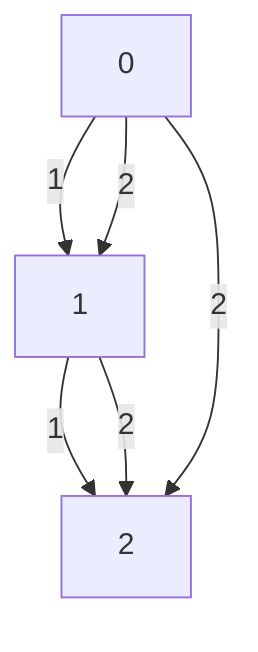

</td>
<td width="100%">

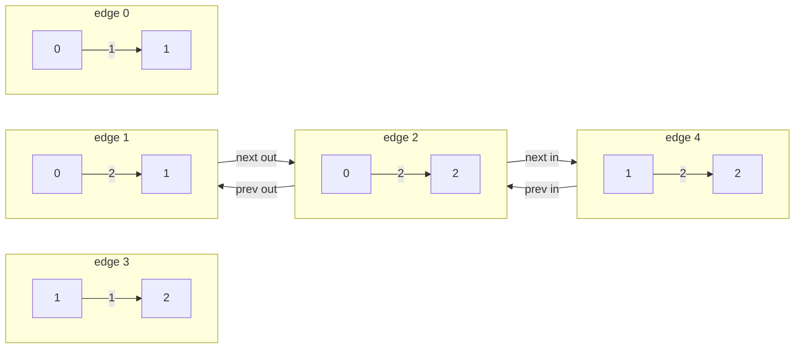

</td></tr>
</table>

Because edge records are only created once per unique pair of node ids
and edge type, and deleted edges do not get reclaimed (without a resize
and rehash of every edge, see [Resizing the `EdgeTypeMap`](#resizing-the-edgetypemap)),
the maximum number of node records that will be stored is `d + n * n * e`,
where `n` is the number of nodes and `e` is the number of _unique_ edge types,
and `d` is the number of deleted edges.

### Edge fields

Edge records occupy **32 bytes** of contiguous space,
labelled as the following **`uint32` (4 byte)** fields:

- `NEXT`: The next edge record with the same hash
- `TYPE`: The edge type
- `FROM`: The id of the originating node
- `TO`: The id of the terminating node
- `NEXT_IN`: The address of the next incoming edge of the same type to the same terminating node
- `PREV_IN`: The address of the previous incoming edge of the same type to the same terminating node
- `NEXT_OUT`: The address of the next outgoing edge of the same type from the same originating node
- `PREV_OUT`: The address of the previous outgoing edge of the same type from the same originating node

#### Sizing the `EdgeTypeMap`

The capacity of `EdgeTypeMap` is always _at least_ the total number of edges
in the graph.

Note that between any two nodes, there my only be one edge per unique edge type.

Recalling that the `Uint32Array` is partitioned into 3 subarrays:

| header | hash table | addressable space |
| ------ | ---------- | ----------------- |

Given a capacity of `c`:

- The first 3 values in the `Uint32Array` are the header: `HEADER_SIZE = 3`
- The hash table is always equal to the capacity: `c`
- The addressable space is equal to the capacity times the item size: `IITEM_SIZE * c`
- The item size is equal to the number of fields on an edge record: `ITEM_SIZE = 8`

The size of the `Uint32Array` is therefore `3 + 9c`.

#### Resizing the `EdgeTypeMap`

The `EdgeTypeMap` is resized on demand in `addEdge`.
There are two scenarios in which the `EdgeTypeMap` is resized:

- if there is not enough capacity in the addressable space
  to accommodate an additional edge

- if there are a enough deletes that the capacity
  can be reduced and still fit the number of edges plus an additional edge.

In the first case, the capacity must increase. This is accomplished by
computing a next capacity from the current capacity. The next capacity
follows a linear progression, starting from the `maxGrowFactor (defaulting to 8)`,
and scaled inversely linearly the `minGrowFactor (defaulting to 2)` from capacity
0 to `peakCapacity`. Roughly the following formula:

```
maxGrowFactor + (minGrowFactor - maxGrowFactor) * (capacity / peakCapacity)
```

Once the `capacity` exceeds `peakCapacity`, the capacity grows by the `minGrowFactor`.

In the second case, the capacity can decrease. This is accomplished by
computing _halving_ the capacity.

In both cases, after computing the next capacity, a new `EdgeTypeMap`
is created with that new capacity along with a new `NodeTypeMap` that retains
its current capacity. Every edge in the current `EdgeTypeMap` is then
_rehashed_ and _relinked_ into the new maps.

## `NodeTypeMap`

The `NodeTypeMap` extends `SharedTypeMap` with API for:

- **adding** nodes
- **linking** nodes to edges
- **unlinking** nodes from edges

### Node records

The `NodeTypeMap` records can be thought of as the heads of
linked lists of edges connected to or from a given node.
There is a linked list _per edge type_, and also _per direction_:

<table style="white-space: nowrap">
<tr><th>given a graph like:</th><th>imagine lists like:</th><tr>
<tr><td>

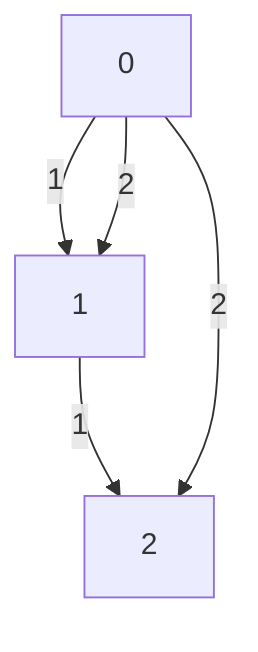

</td>
<td width="100%">

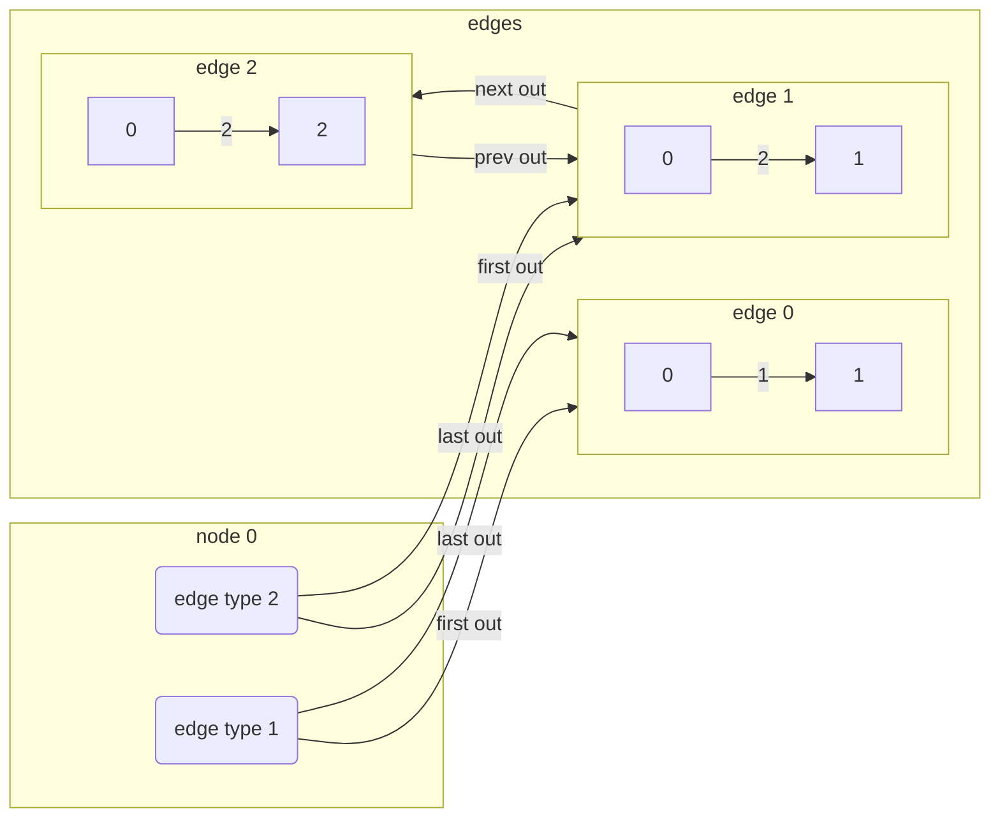

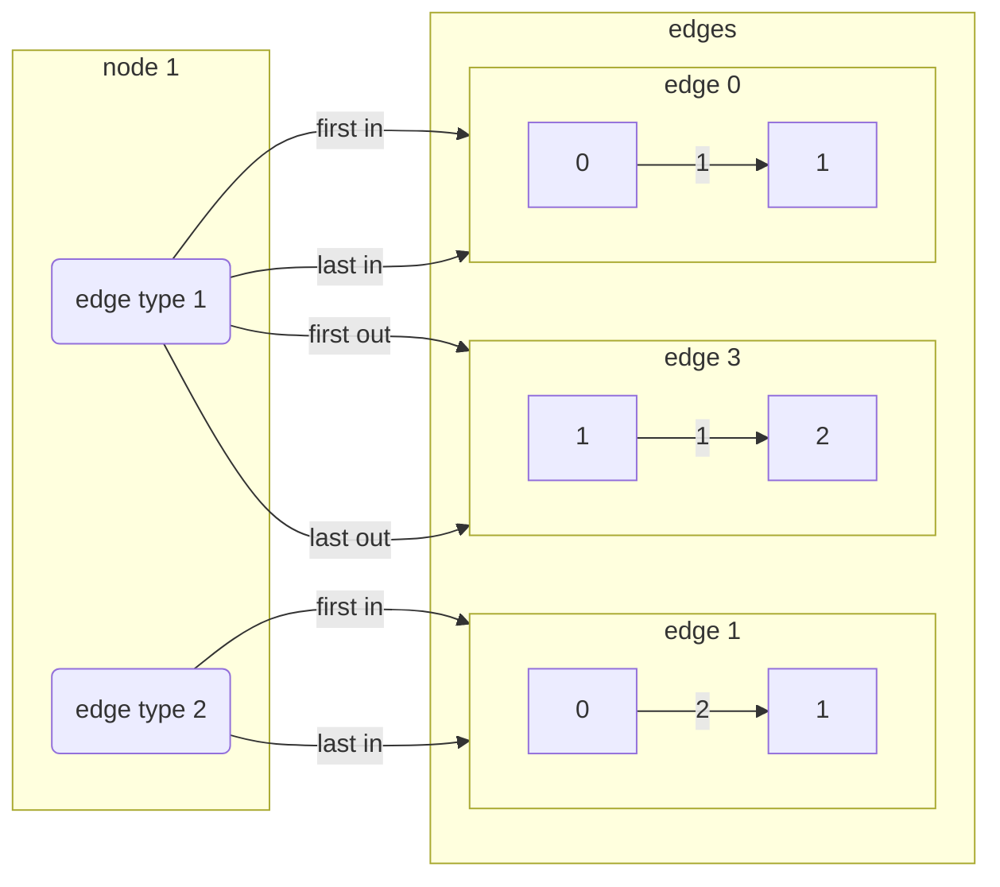

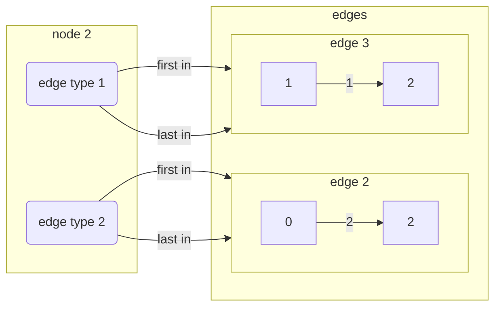

</td></tr>
</table>

Because node records are only created once per unique node id and edge type,
the maximum number of node records that will be stored is `n * e`,
where `n` is the number of nodes (the count of _node ids_ issued)
and `e` is the number of _unique_ edge types in the graph.

### Node fields

Node records occupy **24 bytes** of contiguous space,
labelled as the following **`uint32` (4 byte)** fields:

- `NEXT`: The next node record with the same node id, but a different `TYPE`
- `TYPE`: The edge type for edges linked to or from the node via this record
- `FIRST_IN`: The address in `EdgeTypeMap` of the first edge of this type **to** this node
- `FIRST_OUT`: The address in `EdgeTypeMap `of the first edge of this type **from** this node
- `LAST_IN`: The address in `EdgeTypeMap` of the last edge of this type **to** this node
- `LAST_OUT`: The address in `EdgeTypeMap` of the last edge of this type **from** this node

#### Sizing the `NodeTypeMap`

As implied above, adding a node to `AdjacencyList` does not actually increment
the count of nodes in the `NodeTypeMap`, it only increments the `nodeId`.
This means that the number of nodes in the graph is _not the same as_
the number of node records in the `AdjacencyList`.

However, the capacity of `NodeTypeMap` is always _at least_ the larger of the total
number of node ids issued (`nextId`) or the number of node records in the map (`count`).

The reasons that the capacity must consider both `nextId` and `count` are:

- when a node is connected to an edge, the node id is used
  as the hash in the `NodeTypeMap`, so the hash table must have
  _at least_ enough capacity to fit the highest node id.
- when a node is connected to edges of more than one unique type,
  the additional types require additional node records, which increase the `count`
  and may require additional addressable space (e.g., if most nodes are already connected).

Recalling that the `Uint32Array` is partitioned into 3 subarrays:

| header | hash table | addressable space |
| ------ | ---------- | ----------------- |

Given a capacity of `c`:

- The first 3 values in the `Uint32Array` are the header: `HEADER_SIZE = 3`
  - `NEXT` and
  - `TYPE` have the same meaning as in `SharedTypeMap`
  - `NEXT_ID` tracks the number of unique node ids issued by `addNode`
- The hash table is always equal to the capacity: `c`
- The addressable space is equal to the capacity times the item size: `IITEM_SIZE * c`
- The item size is equal to the number of fields on a node record: `ITEM_SIZE = 6`
  - these are the 6 fields describe in [Node fields](#node-fields)

The size of the `Uint32Array` is therefore `3 + 7c`.

#### Resizing the `NodeTypeMap`

There are two scenarios in which the `NodeTypeMap` is resized:

- in `addNode`, if there is not enough capacity in the hash table
  to accommodate the number of nodes implied by the next node id.

- in `addEdge`, if the edge being added is the first of its type for
  either node, _and_ there is not enough capacity in the addressable space
  to accommodate the additional count of node records required.

In either case, the resizing is accomplished by creating a new `NodeTypeMap`
with double the capacity of the current one, and then copying the data
in the hash table and addressable space directly into the new map.

To account for the increase in the size of the hash table (remember that
the size of the hash table is always equal to the capacity), all pointers
into the addressable space are adjusted by the delta between
the old map capacity and the new capacity, e.g., if the old capacity was 4,
and now it's 8, all of the internal addresses would be shifted by 4.

This works because the node ids are sequential and immutable, so no rehashing
is necessary. The internal addresses can all be safely incremented by
the capacity delta, while the addresses to edges, which point to the `EdgeTypMap`,
don't need to change at all (as its size hasn't changed).

## What `AdjacencyList` really looks like

TODO: Model the actual data

<table style="white-space: nowrap">
<tr><th>given a graph like:</th><th>AdjacencyList looks like:</th><tr>
<tr><td>

```mermeid
graph TD;
  0 --> |1| 1
  0 --> |2| 1
  1 --> |1| 2
  0 --> |2| 2
```

</td>
<td width="100%">

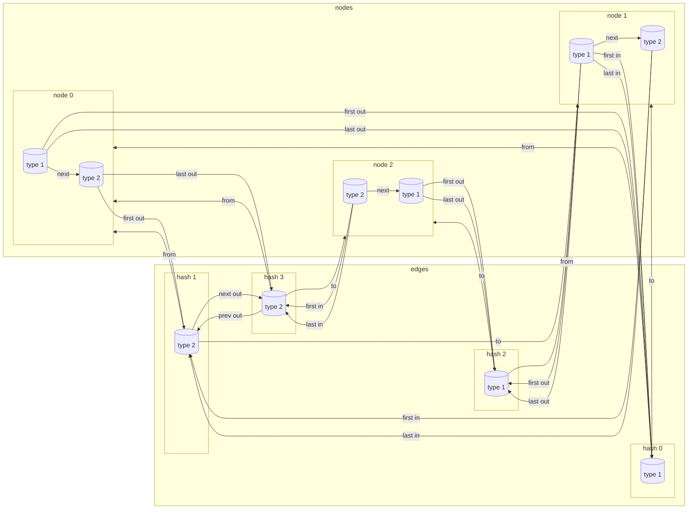

</td></tr>
</table>

Or, as raw `Uint32Array` data:

```
nodes:
  header     hash table                    addressable space
  0  1  2    3   4   5   6  7  8  9  10    11 [ 23  1   7  31   7  31 ]
  8  6  3    17  11  35  0  0  0  0  0     17 [ 29  1   0   7   0   7 ]
                                           23 [  0  2  15   0  15   0 ]
                                           29 [  0  2   0  15   0  23 ]
                                           35 [ 41  2  23   0  23   0 ]
                                           41 [  0  1  31   0  31   0 ]
                                           47 [  0  0   0   0   0   0 ]
                                           53 [  0  0   0   0   0   0 ]
edges:
  header     hash table       addressable space
  0  1  2    3   4  5   6     7  [ 0  1  0  1  0  0   0   0 ]
  4  4  0    15  7  31  23    15 [ 0  2  0  1  0  0  23   0 ]
                              23 [ 0  2  0  2  0  0   0  15 ]
                              31 [ 0  1  1  2  0  0   0   0 ]

```
