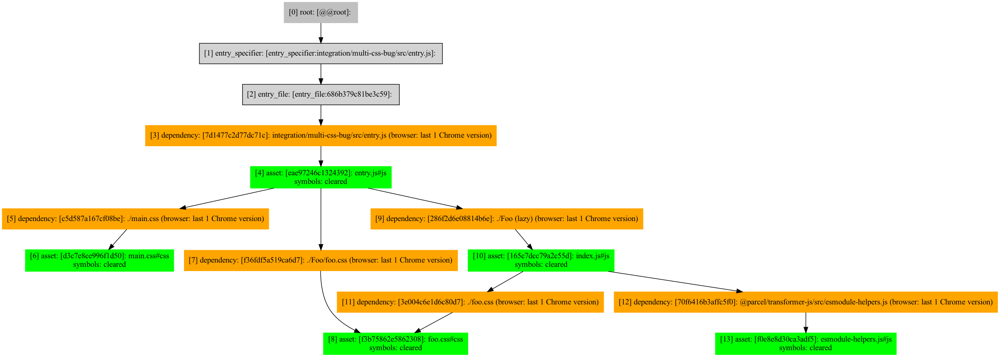
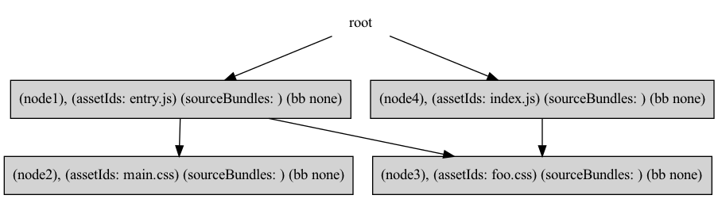
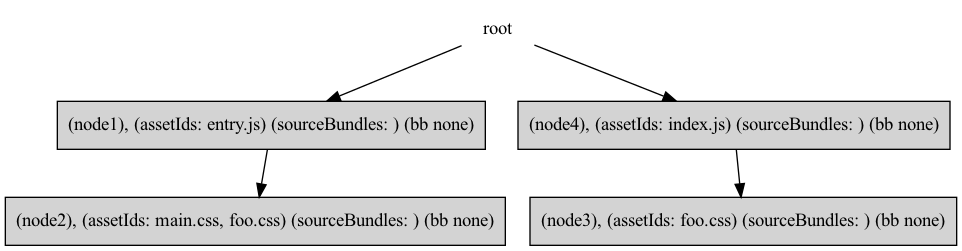

## Targets

## Common JS

## Two CSS imports

Here we'll go through what occurs in an example where two entries to a project import different css files.

Given one `js` entry, an async `js` import, and two `css` imports, we generate the following Assetgraph,

Below is the local bundleGraph generated after **Step Create Bundles**. **Node 1** is generated in the first step because it is specified as an entry to the project.

The full test case can be found in the `multi-css-multi-entry-bug/src/` integration test.

## CSS Modules

CSS Modules are unique in the sense that they are represented as two assets, one `js` and one `css`

## Internalized Asynchronous Asset

In this scenario, reachable is x

## Siblings Script Tags in HTML (aka Parallel Siblings Availabilty)

## Reused Bundle Vs. Shared Bundle

The full test case can be found in the `reused0bundle` case in `bundler.js` integration test file.
