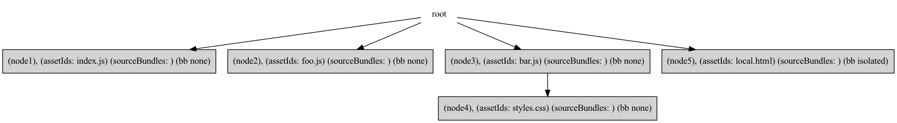
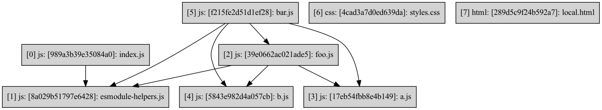
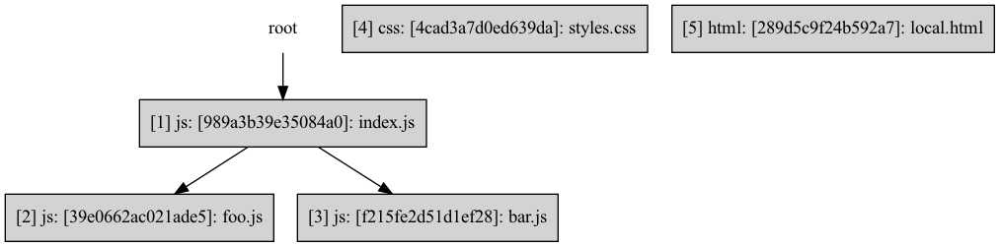
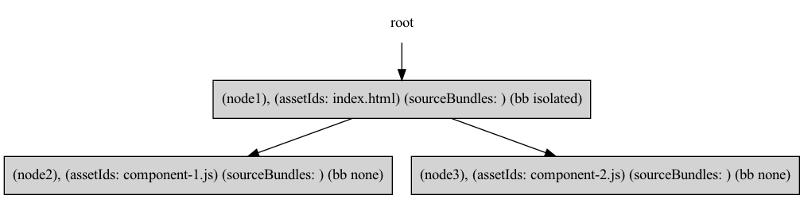
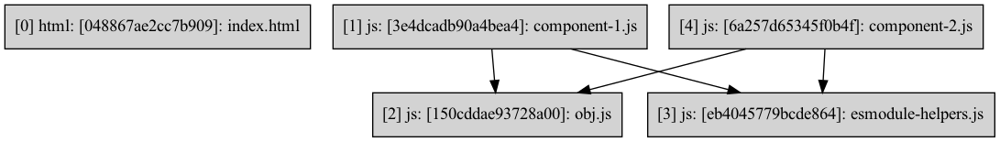

## `bundle()`

During the bundling phase, we hand over control to the bundler plugin via `bundle()`. This mutative function is called in the `BundleGraphRequest`, and is passed in a stripped version of the AssetGraph, called the `mutableBundleGraph`. Users can specify custom bundler plugins in their `.atlaspackrc`. In this document we will go through the default bundler plugin.

```
await bundler.bundle({
          bundleGraph: mutableBundleGraph,
          config: this.configs.get(plugin.name)?.result,
          options: this.pluginOptions,
          logger,
          tracer,
        });
```

### Targets

Targets are specified in the `package.json`. Read more about targets [here](https://parceljs.org/features/targets). For the bundler, this means that the final graph output must be completely disjoint between targets, because those bundles will be separately packaged. Shared bundles cannot exist between separate targets. To remedy this constraint, we create a target map, representing targets mapped to entry assets and what dependencies are part of that target.

```js
targetMap: DefaultMap<string, Map<Asset, Dependency>>
```

We create one IdealGraph per target, but mutations are applied to the same mutableBundleGraph. This ensures that we can return a singular bundleGraph, but generate bundles that **only** reference assets available to them within that target. See "targets" example in [Bundler Examples](./BundlerExamples.md)

# Default Bundler Plugin

The goal of the bundler is to mutate the Assetgraph into a BundleGraph by adding bundles and edges. These bundles can be thought of as groupings of assets, which will be executed together in the browser at runtime. The bundler ensures two things, correct temporal order of assets, and optimizing bundles to favor less duplication.

The DefaultBundler can be divided into two main parts, `CreateIdealGraph` and `decorate()`. In order to write the bundling algorithm in distinct, disjoint steps, we defer mutating the AssetGraph to a step called `decorate()`. The bulk of the algorithm is executed on a localized, smaller _IdealGraph_ that only represents bundles, and a few other supplementary structures ultimately passed to decorate as an `IdealGraph` object, containing our local representation of the bundleGraph.

```
  type IdealGraph = {|
    assets: Array<Asset>,
    dependencyBundleGraph: DependencyBundleGraph,
    bundleGraph: Graph<Bundle | 'root'>,
    bundleGroupBundleIds: Set<NodeId>,
    assetReference: DefaultMap<Asset, Array<[Dependency, Bundle]>>,
    manualAssetToBundle: Map<Asset, NodeId>,
  |};
```

Note: Within `createIdealGraph()`, the local IdealGraph is referred to simply as the bundleGraph, while the `mutableBundleGraph` passed in, is referred to as assetGraph. This is because we don't actually add bundles to the `mutableBundleGraph` until `decorate()`. Until that point it is just an assetgraph.

## Step: Create Entries

Create bundles for each entry to the project. Entries can be specified in the build command by the user.

To create an entry bundle we just need to provide the actual asset, target, and `needsStableName`. `needsStableName` refers to the bundle name. If set, the name will not have a hash for loading purposes.

```js
let bundle = createBundle({
  asset,
  target: nullthrows(dependency.target),
  needsStableName: dependency.isEntry,
});
```

Entries are a type of **bundleGroup** and are thus added to the graph with a connection to the root to denote this. You'll notice some redundancies throughout the algorithm. Here is one such case. `bundleGroupBundleIds` tracks **bundleGroups**, all of which are connected to the root of the `bundleGraph`. An optimization here would be to replace all usage of `bundleGroupBundleIds` with a look up to the graph.

### How to create a bundle

A bundle is just a representation of a asset or assets with information about how to package them. Below are the options you may pass in. Different bundle types require different information. For example, some bundles have a `mainEntryAsset`, like entries, and some do not. We'll get into what bundles contain what information later.

```js
    uniqueKey: opts.uniqueKey, // can be read by namers for more functionality
    assets: new Set([asset]), // The set of all assets in the bundle
    mainEntryAsset: asset, // The main or initial asset of the bundle, can be null
    size: asset.stats.size, // size
    sourceBundles: new Set(), // The bundles which load and require this bundle
    target: opts.target, // Target for output purposes
    type: opts.type ?? asset.type, // type, js, html etc
    env: opts.env ?? asset.env,
    needsStableName: Boolean(opts.needsStableName), // whether to hash the final name
    bundleBehavior: opts.bundleBehavior ?? asset.bundleBehavior,
    manualSharedBundle: opts.manualSharedBundle,
```

## Step: Create Bundles for explicit code split points

### Overview

This step creates bundles for explicit code split points. These are…

- Asynchronous: this bundle does not need to load automatically, it can load in tandem with others

- Isolated: Cannot share any assets with other bundles

  - Example: A URL import import url from 'url:./resource.txt';

  - A key difference between bundlers (past and present) here is that we’ve implicitly created a relationship of one asset to one bundle, and so if a dependency is isolated for example, then we mark that bundle isolated for all purposes. This means it cannot share any assets with other bundles.

- A type change: If the parent asset is a different type than the child. Assets of different types do not belong in the same bundle.

- Parallel: Separate bundle but loaded with the parent.

- Inline: Separate bundle, which is placed into the parent bundle before writing to dist.

  - SVG image inlined into html: ``

More on code splitting: [Code Splitting](https://parceljs.org/features/code-splitting/).

### Deep Dive: Traverse The AssetGraph

After creating our entry points, we traverse the assetGraph, skipping any entries of different targets. On an asset, we begin to populate `assetIndex`, a mapping by which to look up any `bitSet` values. Then, we grab the `bundleIdTuple` from the `bundleRoots` structure.

- `bundleRoots: Map<Asset,[NodeId, NodeId]` is a mapping of bundle-root assets. This means they are roots of a bundle. Think of these assets as assets which triggered the creation of a bundle, and are the **main entry** of a bundle. All explicit code-split points (all of which are handled in this step), are "bundleRoots"

We use the `stack` to track what bundleGroup we are currently in, so that we can accurately draw edges between bundles. `BundleIds` and `BundleGroupIds` are not the same, but can be. This is how we are able to reduce node bloat in the graph. In `createIdealGraph`, "bundleGroups" are simply represented by bundles that are attached to the root. Thus, when `bundleId === bundleGroupId`, or in this case, the tuple values are equivalent, we know we have entered a new bundleGroup.

```js
if (bundleIdTuple[0] === bundleIdTuple[1]) {
  // Push to the stack on a new bundle group
  stack.push([node.value, bundleIdTuple[0]]);
}
```

The top of the stack will track what bundleGroup we are currently on.

#### Code Split for Lazy and isolated Dependencies

Consider the below code obtained from `integration/shared-bundle-single-source/index.js`

<table><tr>
<td>

```js
//index.js (project entry)
import('./foo'); //async imports
import('./bar'); //async
```

</td><td>

```js
//bar.js
import styles from './styles.css';
import html from './local.html'; //isolated
```

<td>
</tr></table>



IdealBundleGraph from `integration/shared-bundle-single-source/index.js`

All the bundles above are explicit code-split points, but not all of them are "bundleGroups". As a rule of thumb, only Entry bundles, Async Bundles, and "isolated" Assets are bundleGroups. `Isolated` is found on the `bundleBehavior` property of bundles, which is typically set in a Transformer. `HTML` and images tend to be `isolated`.

#### Code Split for Type Change, Parallel, and Inline Dependencies

We also create bundles for type change assets, parallel dependencies, and inline assets.

```js
parentAsset.type !== childAsset.type ||
  dependency.priority === 'parallel' ||
  childAsset.bundleBehavior === 'inline';
```

Bundles created by this path are **not** bundleGroups, and can also be merged with bundles of the same type. The stack not only tracks what bundleGroup we're in, but also the last "parent" bundle, or `referencingBundleRoot`. We draw an edge from the `referencingBundleRoot` to our new bundle. We preemptively attempt to merge this bundle into any existing bundle of the same type **within our bundleGroup**. Merging is also handled in the next step, we track what bundles are eligible for merging via `typeChangeIds`.

## Step: Merge Type Change Bundles

Type change bundles are a special case of bundle, because they require consistent or “stable” names, when in an entry bundleGroup, meaning they are directly connected to an entry of the project. As a result, we only allow one bundle of another type per bundleGroup. So, we need to merge bundles that exist within the same bundleGroups. (i.e. siblings)

See CSS example in [BundlerExamples.md](./BundlerExamples.md) for a step-by-step example of how we merge type change bundles.

## Step: Determine Reachability

Here is where we begin building up the graphs required to determine where to place assets. The first is called reachableRoots. ReachableRoots maintains all bundleRoots and what assets are available to them synchronously.

From the above example:

<table><tr>
<td>

```js
//bar.js
import a from './a';
import b from './b';
import styles from './styles.css';
import html from './local.html'; //isolated
```

</td><td>

```js
//a.js
import foo from './foo';
```

<td>
</tr></table>

Given those imports, here are our synchronous relationships. This means `bar.js` synchronously requires `foo`, `b.js`, and `a.js`. Leaf nodes (Nodes with **only** incoming connections), are **not** bundleRoots and will therefore be placed into a number of existing bundles. Nodes with **outgoing** edges **are** bundleRoots and correspond to a bundle we've already created.


We also begin building up the **bundleRootGraph** which maintains bundleRoots and their **parallel** and **async** relationships via different edge types.

From the same example, here are the asynchronous and parallel relationships. Below shows that `index.js` requires `foo.js` and `bar.js` bundles.


This graph does utilize edge types to differentiate between parallel and async relationships, so querying the graph may look something like this:

```
bundleRootGraph.getNodeIdsConnectedTo(id, ALL_EDGE_TYPES);
```

_Note: In order to optimize structures, ReachableRoots is a bitSet and bundleRootGraph is a graph of numbers, as of the writing of this document. Both, however, represent assets and used to be graphs of asset nodes. The above example uses a graph representation of reachableRoots and BundleRoot graphs. To produce such a graph for developmental purposes, the graph visualizer at `dumpGraphToGraphViz.js` could be expanded to translate these bitSets or graph of numbers._

## Step: Determine Availability

Now, in order to know where to place assets, we construct a mapping of all assets available to a bundleRoot (or bundle). This is called ancestorAssets and it is populated with assets available via older siblings, assets within the same bundleGroup, and parent and ancestor bundles.

In general, this is the formula we follow for populating the assets available to a particular bundle:

```
  (assets(P1) ∩ assets(P2) ..... ∩ assets(Pn)) U
  (assets(S1) ..... U assets(Sn)) U
```

Where _P_ is parent, and _S_ is an **older** sibling, i.e. first in load order. And the assets of a parent can be defined as the following, where _B_ is a bundle in the current bundleGroup defined as a bundle connected **directly** to the Parent bundle we are currently processing

```
assets(B1) U assets(B2) .... assets(Bn)
```

At each bundleRoot, we first determine the assets that would be available via bundleGroup, since the bundles in a bundleGroup are loaded together. This is the bundles in the bundleGroup (BundleRoot Assets + Synchronously available Assets).

Next, we “peek ahead” to the children, and propagate the available assets down, intersecting as we go since that will be the set of assets available by any “path”.

In the case of sibling parallel dependencies, the younger siblings have access to the assets of the older siblings, since they load in order, so we must propagate those too. This ensures we can extract shared code between siblings

For Example, integration/html-js-dedup/index.html

```html
<!DOCTYPE html>
<script type="module" src="component-1.js"></script>
<script type="module" src="component-2.js"></script>
```





What is ancestorAssets ? What about the output ?

```// ancestorAssets
index.html => {},
component1 => {},
component2 => {html-js-dedup/component-1.js}
```

Because component1 bundle loads first, there is no need to add `obj` to both siblings. `Index.html` is isolated and thus its availability is not propagated down to the children.

```
Entry Bundle =>     [index.html]
Sibling Bundle 1 => [component1, obj.js]
Sibling Bundle 2 => [component2]
```

## Step: Internalize Async Bundles

Internalization is when some bundle requires an asset synchronously, but also asynchronously. This is redundant so we do not load the extra (async) bundle. We mark this in `bundle.internalizedAssetIds`, and an internalized asset is ultimately displayed as an orange edge.

In previous iterations of the bundler, this step would have been costly, since to determine if an asset is available synchronously, we would've traversed the graph upwards in search of it. Now we simply consult `reachableRoots` and `ancestorAssets`, which tells us if the asset we want to load via asynchronous bundle is either available to us synchronously or via our ancestors.

```js
if (
  reachableAssets[parentId].has(bundleRootId) ||
  ancestorAssets[parentId]?.has(bundleRootId)
) {
  // internalize
}
```

A bundle can be **deleted** in this step if we determine that all those who request this particular asynchronous bundle already have it available to them by some other means. We denote this with `canDelete`.

## Step: Insert or Share

Here, we finally place assets into bundles which require them. All of the previous work we've done assumes all synchronous assets will be available to the bundle that needs it, but we haven't actually placed those assets in yet. If an asset is “reachable” from many bundles, we can extract it into a shared bundle.

You may think of reachable as all the bundles that still need an asset by some means. We filter it down to ensure we only place assets where they need to be. Any bundle that contains the asset in question in its ancestorAssets is filtered out, & entries are filtered out.

### Reused Bundles

There’s a special case here, which is reusing bundles. We noticed sometimes, if two or more bundles shared the whole contents of another bundle, reusing that bundle is as simple as drawing an edge, as opposed to creating a shared bundle that would essentially be a copy of another.


In the above example, foo.js is a reused bundle. You can tell a bundle is reused if it has both an entry asset and source bundles.

For a step by step explanation through the code and example, checkout the "Reused Example" in [BundlerExamples.md](BundlerExamples.md)

### Other special cases

Throughout the `DefaultBundler` There are references to `ManualSharedBundles`, this is an unstable feature, please see [Manual Bundling](ManualBundling.md) for contributor notes on that feature.

### Other special cases

Finally, after we've considered our asset for the above special cases, we're now left to create shared bundles. Generally, the rule is that if our `reachable(asset) > 1`, we can place our asset into a shared bundles and draw an edge to those `reachable` bundleRoots.

Config can change this behavior, so beware. Since we process assets one by one, we need a key by which to look up if this particular set of `bundleRoots` already has a shared bundles.

```js
let key = reachableArray.map(a => a.id).join(',');
```

The key-to-bundle mapping is stored at `bundles`. That way if we have the following reachable, we can create a shared bundle the first time we need some sharing between bundleRoots `foo.js` and `bar.js` and the second time we hit that exact reachable, we can simple add in `b.js`.

```
reachable
a => {bar, foo}
b => {bar, foo}
```

Shared bundles can also have internalized assets, so we need to update upon creation of this bundle.

```
sharedInternalizedAssets.intersect(parentBundle.internalizedAssets);
```

That's it! The next few steps only kick in if your bundler config specifies.

## Step: Merge Shared Bundles

Users of Atlaspack can specify a bundler config, which sets `minbundleSize`, `maxParallelRequests`, and `minBundles`. In this step we merge back and shared bundles that are smaller than `minBundleSize`.

These config options only affect shared bundles. For more on the config options, visit the [Atlaspack Docs on Shared Bundles](https://parceljs.org/features/code-splitting/#shared-bundles).

## Step: Remove Shared Bundles

Finally, we remove shared bundles to abide by `maxParallelRequests`. `maxParallelRequests` semantically affects how many bundles are to be loaded at once, and syntactically affects how many bundles can be in a bundle group.

One difference between the previous implementation and the current is here, where we also merge back “reused” bundles. Unlike shared bundles, reused bundles may have children, so we must update the graph accordingly. Below is an example graph from shared-bundle-reused-bundle-remove-reuse/index.js

# BundleGraph Decoration

BundleGraph decoration takes an idealGraph and mutates the passed-in assetGraph aka Mutable bundleGraph, in order to back port our idealGraph to what Atlaspack expects.

## Definitions

- **Asset:** A file or representation of a file with some information about how it should be bundled

- **Bundle:** A grouping of assets which are loaded together and within the same location

- **BundleGroup:** Group of bundles which will load together, which has an entry bundle (the first bundle to load out of the group)

  - _Note the existence of LegacyBundle which refers to the old Bundle structure_

- **AssetGraph:** A Graph representing Assets and their Dependencies as they appear in a user’s project

- **BundleGraph:** A Graph maintaining Bundles, Assets, Dependencies, and Entries as Nodes, with relationships as edge types

- **local BundleGraph:** Within `CreateIdealGraph()`, we maintain a local BundleGraph which represents only bundles that load in parallel, represented by being attached to the root dummy node.

- **Default:** The Default BundleGraph (which you will most commonly see throughout Atlaspack) maintains the nodes mentioned above and is a modified version of the AssetGraph.

- **IdealGraph:** Structure which contains the local bundleGraph, dependencyBundleGraph, BundleGroupIds, and a mapping of asset references. This stores all info needed to back-port our structures to the “standard” bundleGraph

- **dependencyBundleGraph:** Maps bundles to their dependencies

- **bundleRoots:** An Asset which is an entry to a Bundle

- **reachableBundles:** A graph maintaining Synchronous relationships between bundleRoots

- **BundleRootGraph:** A graph maintaining Async and Parallel relationships between bundleRoots

- **Entries**

  - **Entry to Project:** A file the user points Atlaspack at, in the bundler, this is a set of assets

  - **Entry to A Bundle:** The main or first asset in a bundle

  - **Entry to A BundleGroup:** The main or first bundle in a bundleGroup, which triggers the bundleGroup to be loaded

- assetReference: For bundles within the same bundleGroup as their parent, reference edges are drawn between bundles and dependencies
