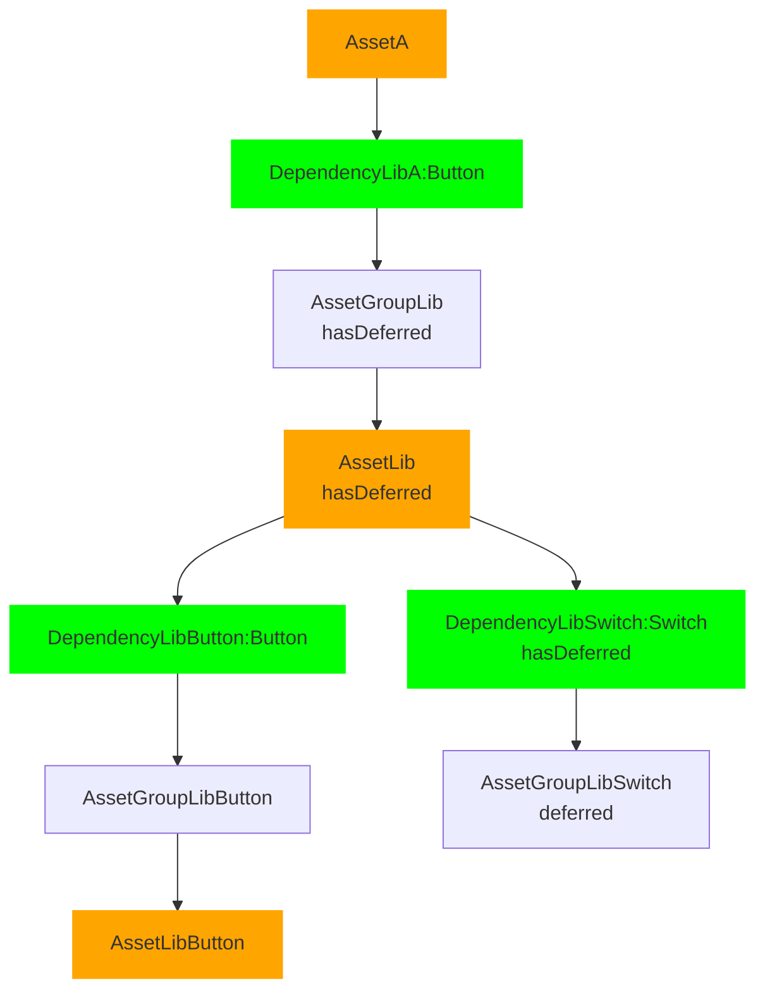
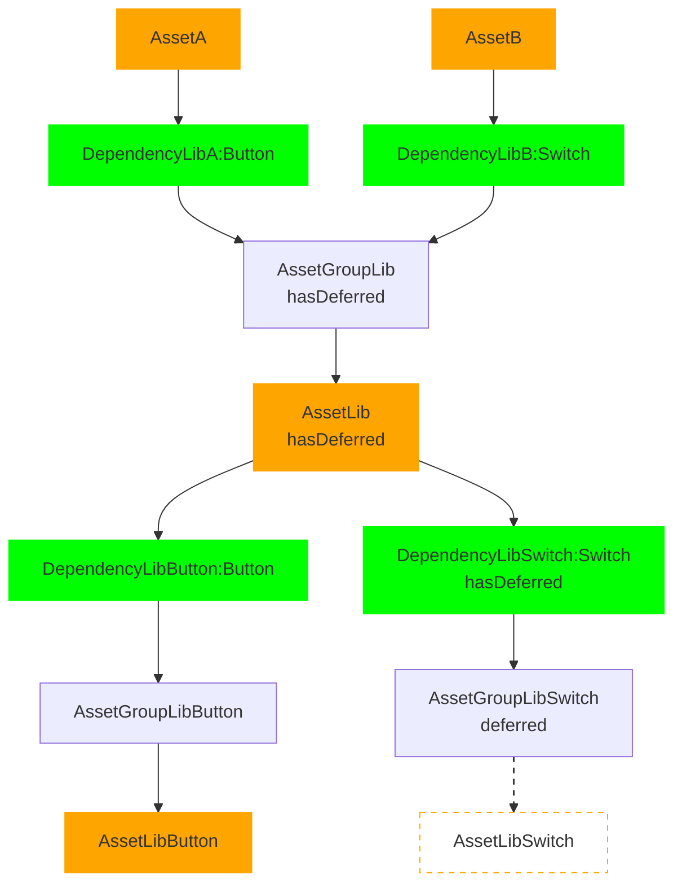

# Deferring Assets

(The core idea and benefits are described in [Scopehoisting](Scopehoisting.md)).

Even if the usual way to describe deferring is via dependencies (and this is also how the API exposes it), the entity that's actually getting deferred is the asset group node. This is because the dependency is just the dependency "request" (though not as in "request" graph) and doesn't know yet whether the resolved asset is side-effect free. That is only known after the resolver ran (and the resolver result is stored in the asset group node).

## Deferring

This might be the current state of the asset graph during transformation, only the "Button" reexport of the library is used so far, and the other reexport "Switch" wasn't imported anywhere (yet). So the "Switch" asset was deferred.

The `deferred`/`hasDeferred` properties respond to the asset graph node properties.

This is detected in [`assetGraph.shouldVisitChild(DependencyLibSwitch, AssetGroupLibSwitch)`](https://github.com/parcel-bundler/parcel/blob/9e5d05586577e89991ccf90400f2c741dca11aa3/packages/core/core/src/AssetGraph.js#L305) which calls `assetGraph.shouldDeferDependency` (reads the symbol information and determines if the dependency is unused). Then `markParentsWithHasDeferred(DependencyLibSwitch)` is called to add the `hasDeferred=true` flags for the parent asset and asset group nodes.

Because `shouldVisitChild` returns false, the graph traversal never visits the asset group node and also never transforms the corresponding asset.

### Undeferring

Now another dependency is added/discovered during transformation, the asset group should be undeferred and the asset should get transformed:

`DependencyLibB` got added to the graph and now all its children are considered: in the asset graph request traversal's `visitChildren` wrapped, there's [an override to revisit nodes if they have `hasDeferred=true`](https://github.com/parcel-bundler/parcel/blob/9e5d05586577e89991ccf90400f2c741dca11aa3/packages/core/core/src/requests/AssetGraphRequest.js#L169). This causes `AssetLib` and in turn `DependencyLibSwitch` to be revisited.

`shouldVisitChild` and `shouldDeferDependency` then determine that `AssetLibSwitch` is now used and call `unmarkParentsWithHasDeferred(AssetGroupLibSwitch)` which clears `DependencyLibSwitch.hasDeferred`, clears `AssetLib.hasDeferred` (but only if there is no other sibling dependency that is still deferred), and sets `AssetGroupLib.hasDeferered = AssetLib.hasDeferred`.

`shouldVisitChild` returns true and `AssetGroupLibSwitch` gets visited for the first time, also transforming the asset and creating the asset node.
