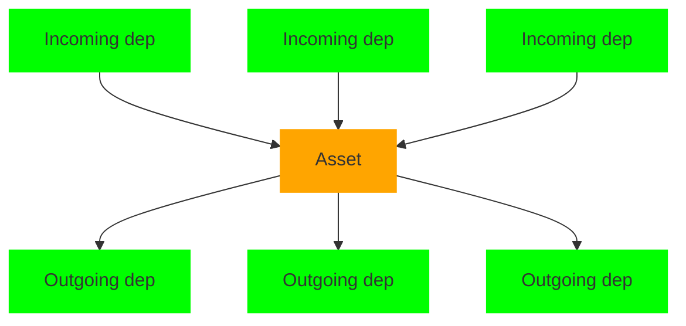
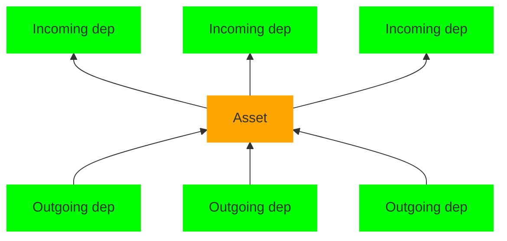

# Symbol Propagation

The goal of symbol propagation is generating the sets of (transitively) used symbols based on the symbols set on assets and dependencies (see [Scopehoisting](Scopehoisting.md)).

## Two Passes

In the most basic case, the used symbols can be determined by traversing through all assets, and repeatedly forwarding the symbols of incoming dependencies down through the reexports corresponding to outgoing dependencies (and always matching them to the correct reexport, potentially also renaming the symbol).

But with `export *`, there is no unique reexport to match an incoming symbol request to:

```js
// index.js
import {a} from './other.js';

// other.js
export * from './x.js'; // Is `a` reexported here...
export * from './y.js'; // ... or here? Or neither?

// x.js
export const a = 1;
// y.js
export const b = 2;
```

Instead, there are two passes:

- in the first ("down") pass, the incoming used symbols are matched to the correct reexport (if there is one), or to _all_ `export *`. So after this pass, the symbol will be marked as used in all potentially relevant dependencies (one of which will be the correct one).

- in the second ("up") pass, the set of requested symbols (from the down pass) is intersected with the set of actual exports and copied back from the outgoing dependencies to the incoming dependencies. There are multiple cases that can occur:
  - There is exactly one dependency that can provide the export.
  - There is no dependency that can provide the export, which leads to a ["x does not export y" error](https://github.com/parcel-bundler/parcel/blob/f65889ebd768e9b2e146537b47d4d5d82ff177b8/packages/core/core/src/requests/AssetGraphRequest.js#L754-L776).
  - (For `export *`:) There are multiple dependencies that can provide the export. This can happen with valid ESM (and the first value will be used), or with non-statically analyzable CJS modules where we have to determine at runtime which value to use. [There's a verbose warning in this case](https://github.com/parcel-bundler/parcel/blob/f65889ebd768e9b2e146537b47d4d5d82ff177b8/packages/core/core/src/requests/AssetGraphRequest.js#L560-L569).

<table>
<tr><th>Data Flow in Down Traversal</th><th>Data Flow in Up Traversal</th></tr>
<tr><td>



</td><td>



</td></tr>

<tr><th>After Down Traversal</th><th>After Up Traversal</th></tr>
<tr><td>

```js
// index.js
import {a} from './other.js'; // used down: a

// other.js, used down:
export * from './x.js'; // used down: a
export * from './y.js'; // used down: a (!)

// x.js, used down: a
export const a = 1;
// y.js, used down:
export const b = 2;
```

</td><td>

```js
// index.js
import {a} from './other.js'; // used down: a, used up: a

// other.js, used down:
export * from './x.js'; // used down: a, used up: a
export * from './y.js'; // used down: a, used up:

// x.js, used: a
export const a = 1;
// y.js, used:
export const b = 2;
```

</tr>
</table>

This is why `DependencyNode#usedSymbolsUp` are the actual used symbols, and `DependencyNode#usedSymbolsDown` is just an implementation detail.

## Circular Imports/Reexports

In both cases, circular reexports also have to be considered:

```js
// index.js
import {b} from './other.js';
export const a = 1;
console.log(b);

// other.js
export {a as b} from './index.js';
```

This traversal logic is abstracted away into the `propagateSymbolsDown` and `propagateSymbolsUp` methods in [AssetGraphRequest.js](../packages/core/core/src/requests/AssetGraphRequest.js), while the visitor function that handles the actual symbol data is passed as a visitor callback.

The down pass (`propagateSymbolsDown(...)`) performs a queue-based BFS which will continue re-traversing parts of the graph if they are marked dirty (the flags are described in the next sections). The traversal starts with the changed assets and asset groups that had incoming edges removed (which can lead to less used symbols).

The up pass (`propagateSymbolsUp(...)`) is a post-order recursive DFS if more than half of all assets changed, or a queue-based "reverse" BFS (which covers both incremental updates and circular imports by traversing until nothing is marked dirty anymore).

Another result of having to handle circular imports is error handling. Error cannot be thrown immediately when a missing reexport is encountered, as this situation also occurs when walking dependency cycles (and continuing just a bit longer might cause an outgoing dependency to get updated with the export that was previously missing):

The traversal starts at the leaves (other.js): the incoming `index -> other (down: b)` dependency requests b, but the outgoing `other -> index` dependency which provides `b` doesn't have `a` in the up set yet. So an error is stored for the other.js asset.

Next, index.js is visited, and the incoming dependency `other -> index (down: a)` can indeed be satisfied with the export and is therefore added into `usedSymbolsUp`.

Because `other -> index` was changed, the parent asset is revisited (other.js), and the incoming `index -> other (down: b)` request for `b` is again matched to `a` in the reexport, and the outgoing dependency does indeed have `a` in `outgoing.usedSymbolsUp` so `b` is added to `incoming.usedSymbolsUp`. Since no error was generated when processing other.js, the error from the previous iteration gets discarded.

| up iteration          | `import {b}`           | `export {a as b}`                                                          |
| --------------------- | ---------------------- | -------------------------------------------------------------------------- |
| start                 | `usedSymbolsDown`: `b` | `usedSymbolsDown`: `a`                                                     |
| 1, asset=other.js     |                        | Error: `a` not found in `usedSymbolsUp` of outgoing dep (the `import {b}`) |
| 2, asset=index.js     |                        | `usedSymbolsUp`: `a`                                                       |
| **3, asset=other.js** | `usedSymbolsUp`: `b`   | `usedSymbolsUp`: `a`                                                       |
| 3, asset = index.js   | `usedSymbolsUp`: `b`   | `usedSymbolsUp`: `a`                                                       |

Furthermore, it's possible that there are multiple errors for missing exports. But it's hard to determine which of these have the same cause (because in such a circular reexporting chain, all nodes would show an error, there is no "first" one), so it simply throws the first error in the list. This has the downside of only showing one error at a time even if the code contains multiple (unrelated) problematic imports in different assets.

## Down Traversal

1. Categorize incoming usedSymbols into `asset.usedSymbols` or the `namespaceReexportedSymbols` based on whether they're listed in `asset.symbols`. So `asset.usedSymbols` now also contains reexports, which will be removed again in the next step.
2. If the asset has no side effects and also nothing is requested by the incoming dependencies, then the entire subgraph is unused and no symbol will be used.

   Otherwise the `namespaceReexportedSymbols` are redistributed to the `export *` dependencies' `usedSymbolsDown` , and the contents of `asset.usedSymbols` are forwarded to individual dependencies' `usedSymbolsDown` where possible (= a reexport = where there's a symbol in the dependency matching the one in the asset symbols).

If some outgoing dependency was changed by these steps, it's marked as dirty:

- `dep.usedSymbolsDownDirty = true` so that the dependency resolution will be revisited later in this traversal.
- `dep.usedSymbolsUpDirtyDown = true` so that the up traversal knows that this dependency now requests some other set of symbols, which could potentially require updates or throw an error.

## Up Traversal

1. Go through outgoing dependencies and collect all symbols that are reexported from them in `usedSymbolsUp`.
2. Go through incoming dependencies:

   1. Each symbol that is requested by that dependency (`usedSymbolsDown`) has to be exported by the asset or reexported by some outgoing dependency.

      If a requested symbol cannot be found as a (re)export, then an error "x.js does not export y" is generated. (Unless the incoming dependency is a `export *`, then throwing here would could cause an error for a symbol that was only speculatively added as described above.)

   2. If an incoming dependency is completely unused and also side-effect free, then it's marked as excluded (and now behaves like a deferred dependency).

If some incoming dependency was changed by these steps, it's marked as dirty:

- `dep.usedSymbolsUpDirtyUp = true` so that the asset which has `dep` as an outgoing dependency will be revisited.

## [Storing dependency resolution in the used symbols](https://github.com/parcel-bundler/parcel/pull/8432)

For better codesplitting and to hide the fact that symbol propagation runs on the whole project and not per bundle, dependencies are split to have one symbol per dependency and then retargeted to the asset that this symbol is originally exported from.

To compute this information of where a symbol resolves to, the up traversal doesn't work with sets of symbols anymore but with a [map that lists the symbols together with the asset that symbol resolves to](https://github.com/parcel-bundler/parcel/blob/f65889ebd768e9b2e146537b47d4d5d82ff177b8/packages/core/core/src/types.js#L324-L333). The rules are:

- if a symbol is exported directly (not reexported), then this is stored as the map entry value.
- if a symbol is reexported and the reexporting asset is side-effect free and the symbol unambigously resolves to a single reexport, then the map entry value is just copied over from the outgoing dependency (and still points to the original asset).
- otherwise if a symbol is reexported, then the map entry value is instead the reexporting asset (which will lead to a correct lookup at runtime, as described [above](#two-passes)).

The rewriting of dependencies then happens in [`BundleGraph.fromAssetGraph`.](https://github.com/parcel-bundler/parcel/blob/6211c79f30e8fe2a1e079339277f11dba4acab2c/packages/core/core/src/BundleGraph.js#L210-L226)

## (Optional side note: Data Flow Analysis)

In the big picture, there are some parallels here with [data-flow analysis](https://en.wikipedia.org/wiki/Data-flow_analysis) (which powers unused variable detection or hoisting of common sub-expressions in compilers): a graph is traversed (and parts are revisited) and some local operation is performed for the current node until the node values stabilize (a fixpoint is reached).
